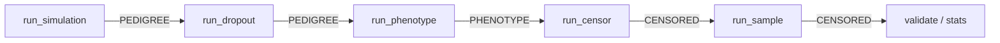

# Pipeline Schema

The pipeline is a chain of stages — `simulate → dropout → phenotype →
censor → sample` — each handing off a `pandas.DataFrame` to the next. The
columns expected at each handoff are an *implicit* contract: every stage
relies on its predecessor's column names by convention, and a downstream
stage will fail far from the rename that broke it.

`simace.core.schema` makes that contract explicit. It defines three
cumulative specs (one per stage output) and a runtime check that fires at
each handoff.

## Three stage outputs

Each schema is a mapping from required column name to a string of allowed
[`numpy.dtype.kind`](https://numpy.org/doc/stable/reference/generated/numpy.dtype.kind.html)
characters. Extra columns are always permitted — stages may carry through
additional fields without breaking the contract.

### `PEDIGREE` — output of `run_simulation` and `run_dropout`

| Column | Kind |
|---|---|
| `id`, `generation`, `sex`, `mother`, `father`, `twin`, `household_id` | `iu` (integer) |
| `A1`, `C1`, `E1`, `liability1` | `f` (float) |
| `A2`, `C2`, `E2`, `liability2` | `f` |

### `PHENOTYPE` — output of `run_phenotype`

`PEDIGREE` plus the raw event-time columns:

| Column | Kind |
|---|---|
| `t1`, `t2` | `f` |

### `CENSORED` — output of `run_censor` and `run_sample`

`PHENOTYPE` plus the columns added by censoring:

| Column | Kind |
|---|---|
| `death_age`, `t_observed1`, `t_observed2` | `f` |
| `age_censored1`, `death_censored1`, `affected1` | `b` (bool) |
| `age_censored2`, `death_censored2`, `affected2` | `b` |

### Why coarse dtype kinds

Dtypes are checked at the kind level (`i`/`u` integer, `f` float, `b`
bool) rather than exact dtypes. This tolerates the `int8`/`int32`/`float32`
narrowing applied by [`optimize_dtypes`][simace.core.utils.optimize_dtypes]
at parquet save time — a column may arrive as `int32` in memory and round-trip
as `int8` on disk without violating the contract — while still catching
real-world regressions like a boolean column written as `int8`, a string
slipping into an integer ID, or a float landing in `generation`.

## Where it's enforced



| Stage | Input asserted | Output asserted |
|---|---|---|
| `run_dropout` | `PEDIGREE` | — (row subset, structurally identical) |
| `run_phenotype` | `PEDIGREE` | `PHENOTYPE` |
| `run_censor` | `PHENOTYPE` | `CENSORED` |
| `run_sample` | `CENSORED` | — (row subset, structurally identical) |

A failure raises `ValueError` with the boundary label and the offending
column, e.g.:

```
censor input: missing required columns ['t1']
phenotype output: dtype mismatch — affected1=int8 (expected kind in 'b')
```

so the rename or dtype regression is pinned to the stage that broke it,
not the analysis 200 lines downstream.

## Using it from tests

When writing a unit test that constructs a `DataFrame` directly (rather
than running the full pipeline), `tests/conftest.py` exposes a
`schema_pad(df, schema)` helper that fills in zero/false defaults for any
schema-required columns the fixture didn't provide. Lets fixtures stay
focused on the columns under test while still satisfying the contract.

## API reference

See [`simace.core.schema`](../api/core.md#schema) for the full module.
