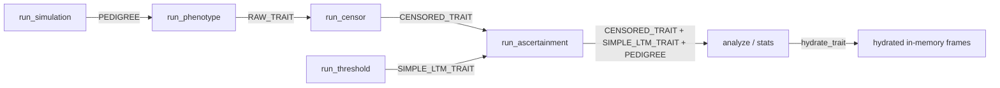

# Pipeline Schema

The pipeline is a chain of stages — `simulate → phenotype → censor → ascertainment → analyze` — each handing off a `pandas.DataFrame` or parquet file to the next. The columns expected at each handoff are a contract: every stage relies on its predecessor's column names by convention, and a downstream stage will fail far from the rename that broke it unless the contract is explicit.

simACE now has two related schema layers:

- `simace.core.schema` defines the **pedigree** schema and hydrated in-memory schemas used by tests and analysis helpers.
- `simace.core.trait_schema` defines the **outcomes-only trait file** schemas and the hydration helper that joins trait outcomes to pedigree columns by `id` (ADR 0011).

Extra columns are permitted by the low-level schema checker unless a hydration call asks for the same column from the pedigree; in that case `hydrate_trait` raises to prevent silently accepting old self-contained trait files.

## Pedigree schema

### `PEDIGREE` — output of `run_simulation`

| Column | Kind |
|---|---|
| `id`, `generation`, `sex`, `mother`, `father`, `twin`, `household_id` | `iu` (integer) |
| `A1`, `C1`, `E1`, `liability1` | `f` (float) |
| `A2`, `C2`, `E2`, `liability2` | `f` |

`pedigree.full.parquet` stores the recorded pedigree before ascertainment.
`pedigree.parquet` stores the ancestor-closure analysis pedigree supporting the
final post-ascertainment trait IDs.

## Outcomes-only trait file schemas

Trait-family parquet files store only trait outcomes. Pedigree links,
demography, ACE components, household IDs, and liabilities live in the
corresponding pedigree parquet and are joined explicitly when needed.

### `RAW_TRAIT` — `trait.raw.parquet`

| Column | Kind |
|---|---|
| `id` | `iu` |
| `t1`, `t2` | `f` |

### `CENSORED_TRAIT` — `trait.full.parquet` and `trait.parquet`

| Column | Kind |
|---|---|
| `id` | `iu` |
| `t1`, `t2`, `death_age`, `t_observed1`, `t_observed2` | `f` |
| `age_censored1`, `death_censored1`, `affected1` | `b` (bool) |
| `age_censored2`, `death_censored2`, `affected2` | `b` |

## Hydration

Consumers that need a self-contained frame call:

```python
from simace.core.trait_schema import hydrate_trait

hydrated = hydrate_trait(trait_df, pedigree_df, kind="censored")
```

Hydration preserves trait row order and returns pedigree columns first, followed
by trait outcome columns. It is strict:

- trait IDs must be unique;
- pedigree IDs must be unique;
- every trait ID must exist in the pedigree;
- requested pedigree columns must not already be present in the trait frame.

Pre-ascertainment trait files hydrate against the actual phenotype input
pedigree (`pedigree.full.parquet`, or `pedigree.full.tstrait.parquet` for
gene-drop scenarios). Post-ascertainment trait files hydrate against
`pedigree.parquet`.

## Why coarse dtype kinds

Dtypes are checked at the kind level (`i`/`u` integer, `f` float, `b` bool)
rather than exact dtypes. This tolerates the `int8`/`int32`/`float32` narrowing
applied by [`save_parquet`][simace.core.parquet.save_parquet] at parquet save
time while still catching real regressions like a boolean column written as
`int8`, a string slipping into an integer ID, or a float landing in
`generation`.

## Where it's enforced


```mermaid
flowchart LR
    sim[run_simulation] -- PEDIGREE --> phen[run_phenotype]
    phen -- RAW_TRAIT --> cen[run_censor]
    cen -- CENSORED_TRAIT --> asc[run_ascertainment]
    phen2[run_threshold] -- SIMPLE_LTM_TRAIT --> asc
    asc -- CENSORED_TRAIT + SIMPLE_LTM_TRAIT + PEDIGREE --> ana[analyze / stats]
    ana -- hydrate_trait --> hyd[hydrated in-memory frames]
```

| Stage | Input asserted | Output asserted |
|---|---|---|
| `run_phenotype` | `PEDIGREE` | `RAW_TRAIT` |
| `run_threshold` | `PEDIGREE` | `SIMPLE_LTM_TRAIT` |
| `run_censor` | `RAW_TRAIT` plus explicit `PEDIGREE` input | `CENSORED_TRAIT` |
| `run_ascertainment` | outcomes-only trait files plus pedigree | outcomes-only trait files plus analysis pedigree |
| Analyze / Stats | outcomes-only trait files plus pedigree | hydrated in-memory frames for computations |

A failure raises `ValueError` with the boundary label and the offending column,
e.g.:

```
censor input: missing required columns ['t1']
trait columns collide with requested pedigree columns; hydrate outcomes-only trait files or drop duplicate columns first: ['generation']
```

so the rename or dtype regression is pinned to the boundary that broke it, not
the analysis 200 lines downstream.

## Using it from tests

When writing a unit test that constructs a `DataFrame` directly, use the schema
constants in `simace.core.trait_schema` for outcomes-only trait files and
`hydrate_trait(...)` for stats helpers that require pedigree columns.
`tests/conftest.py` still exposes `schema_pad(df, schema)` for legacy hydrated
schema fixtures.

## API reference

See [`simace.core.schema`](../api/core.md#schema) and
[`simace.core.trait_schema`](../api/core.md#trait_schema) for the full modules.
