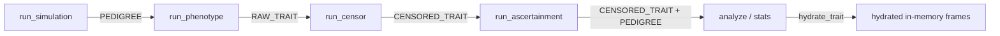

# Pipeline schema

The pipeline is a chain of stages: simulate, phenotype, censor, ascertainment, then analysis. Each stage hands the next a `polars.DataFrame` or a parquet file. Stage boundaries are Polars-only (ADR 0015). The columns at each handoff are a contract. Without an explicit contract, a stage that renames a column breaks a stage far downstream, and the failure appears nowhere near the rename.

Two modules define the contract:

- `simace.core.schema` defines the pedigree schema, `PEDIGREE`, and the hydrated in-memory schemas `PHENOTYPE` and `CENSORED` that tests and analysis helpers use.
- `simace.core.trait_schema` defines the outcomes-only trait file schemas and `hydrate_trait`, which joins trait outcomes to pedigree columns by `id` (ADR 0011).

The schema checker permits extra columns. The one exception is a hydration call that asks the pedigree for a column the trait frame already has. In that case `hydrate_trait` raises, so an old self-contained trait file cannot pass as an outcomes-only file.

## Pedigree schema

### `PEDIGREE`: output of `run_simulation`

| Column | Kind |
|---|---|
| `id`, `generation`, `sex`, `mother`, `father`, `twin`, `household_id` | `iu` (integer) |
| `A1`, `C1`, `E1`, `liability1` | `f` (float) |
| `A2`, `C2`, `E2`, `liability2` | `f` |

`pedigree.full.parquet` is the recorded pedigree before ascertainment. `pedigree.parquet` is the analysis pedigree after ascertainment. It holds the sampled trait IDs plus every ancestor reachable from them.

## Outcomes-only trait file schemas

Trait parquet files hold only trait outcomes. Pedigree links, demography, ACE components, household IDs, and liabilities live in the matching pedigree parquet. A consumer that needs them joins explicitly.

### `RAW_TRAIT`: `trait.raw.parquet`

| Column | Kind |
|---|---|
| `id` | `iu` |
| `t1`, `t2` | `f` |

### `CENSORED_TRAIT`: `trait.full.parquet` and `trait.parquet`

| Column | Kind |
|---|---|
| `id` | `iu` |
| `t1`, `t2`, `death_age`, `t_observed1`, `t_observed2` | `f` |
| `age_censored1`, `death_censored1`, `affected1` | `b` (bool) |
| `age_censored2`, `death_censored2`, `affected2` | `b` |

## Hydration

A consumer that needs a self-contained frame calls:

```python
from simace.core.trait_schema import hydrate_trait

hydrated = hydrate_trait(trait_df, pedigree_df, kind="censored")
```

Hydration keeps the trait row order and returns pedigree columns first, then trait outcome columns. It raises unless all four conditions hold:

- trait IDs are unique
- pedigree IDs are unique
- every trait ID exists in the pedigree
- no requested pedigree column is already in the trait frame

Pre-ascertainment trait files hydrate against the pedigree the phenotype stage read. That is `pedigree.full.parquet`, or `pedigree.full.tstrait.parquet` for gene-drop scenarios. Post-ascertainment trait files hydrate against `pedigree.parquet`.

## Why the checker compares dtype kinds

The checker compares dtypes at the kind level, `i` or `u` for integer, `f` for float, and `b` for bool, rather than exact widths. [`save_parquet`][simace.core.parquet.save_parquet] narrows ID columns to `int32`, sex to `int8`, and ACE components to `float32` at save time, and an exact-width check would reject every file it wrote. A kind-level check still catches the regressions that matter: a boolean column written as `int8`, a string in an integer ID column, or a float in `generation`.

## Where the checker runs

The `@stage(reads=..., writes=...)` decorator in `simace.core.stage` wraps each DataFrame stage. It asserts the input schema on the first argument and the output schema on the return value. It also exposes both schemas as `fn.reads` and `fn.writes`. Every phenotype model, including `simple_ltm`, is a `PhenotypeModel` that runs through `run_phenotype` and `run_censor`. There is no separate threshold stage.


```mermaid
flowchart LR
    sim[run_simulation] -- PEDIGREE --> phen[run_phenotype]
    phen -- RAW_TRAIT --> cen[run_censor]
    cen -- CENSORED_TRAIT --> asc[run_ascertainment]
    asc -- CENSORED_TRAIT + PEDIGREE --> ana[analyze / stats]
    ana -- hydrate_trait --> hyd[hydrated in-memory frames]
```

| Stage | Input asserted | Output asserted |
|---|---|---|
| `run_simulation` | none (no input frame) | `PEDIGREE` |
| `run_phenotype` | `PEDIGREE` | `RAW_TRAIT` |
| `run_censor` | `RAW_TRAIT`. The pedigree argument, from which `run_censor` hydrates `generation`, gets an explicit `PEDIGREE` check | `CENSORED_TRAIT` |
| `run_ascertainment` | outcomes-only trait files plus pedigree. ID-level checks, not `@stage` | outcomes-only trait files plus analysis pedigree |
| Analyze and stats | outcomes-only trait files plus pedigree | hydrated in-memory frames |

A failed check raises `ValueError` naming the boundary and the offending column:

```
censor input: missing required columns ['t1']
trait columns collide with requested pedigree columns; hydrate outcomes-only trait files or drop duplicate columns first: ['generation']
```

The error points at the boundary that broke, not at the analysis code that read the column later.

## Schemas in tests

When a unit test builds a `DataFrame` by hand, use the schema constants in `simace.core.trait_schema` for outcomes-only trait files. Call `hydrate_trait(...)` before passing a frame to a stats helper that needs pedigree columns. `tests/conftest.py` exposes `schema_pad(df, schema)` for the older hydrated-schema fixtures.

## API reference

See [`simace.core.schema`](../api/core.md#schema) and [`simace.core.trait_schema`](../api/core.md#trait_schema).
