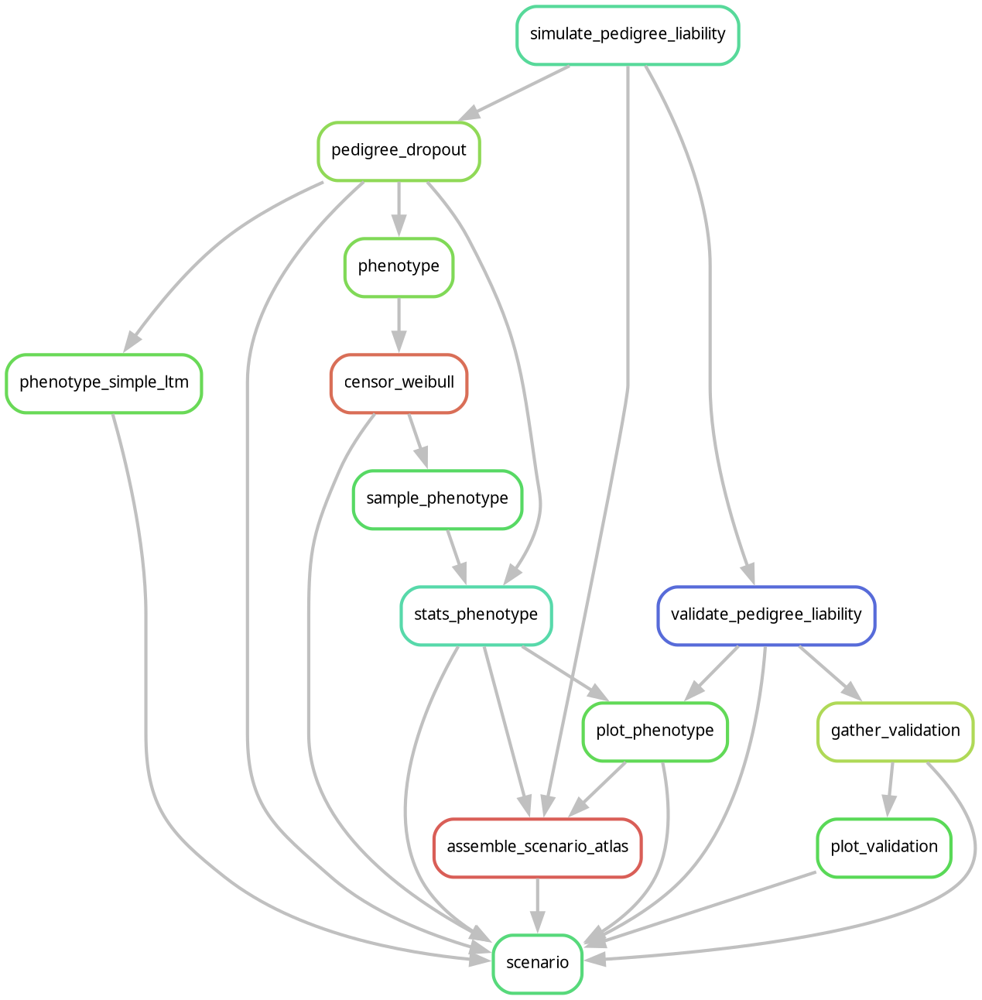

# Simulation Design

## Multi-generational pedigree

The simulation generates `G_sim` total generations:

- `G_sim - G_ped` are **burn-in** generations (simulated but not recorded)
- `G_ped` generations are recorded in the pedigree
- The last `G_pheno` of `G_ped` are phenotyped

Each generation contains `N` individuals. With default settings
($N = 100{,}000$, $G_{ped} = 6$), the recorded pedigree contains
approximately $600{,}000$ individuals.

## Mating and reproduction

In each generation, couples are formed from the potential parent pool
according to the following rules:

- An individual may participate in multiple couples.
- Males and females are paired randomly by default, or assortatively
  on liability via `assort1` and `assort2`.
- Offspring are distributed across matings by a multinomial draw.
- Population size is held constant; some couples produce no offspring.
- MZ twins are assigned to matings with two or more offspring.

At default settings (`mating_lambda = 0.5`), approximately 77% of
individuals have a single partner and 23% have two or more, producing
a natural mix of full sibs, maternal half-sibs, and paternal half-sibs.

## Pedigree relationship types

`PedigreeGraph` (from the [`pedigree-graph`](https://github.com/rwaples/pedigree-graph) package) extracts 23 relationship
categories from simulated pedigrees using sparse matrix algebra. Each type is
parameterised by `(up, down, n_ancestors)` -- meioses up from individual A to
common ancestor(s), meioses down to individual B, and whether the link is
through 1 (half/lineal) or 2 (full, mated-pair) ancestors. Kinship is
$n_{\text{ancestors}} \times (1/2)^{(\text{up} + \text{down} + 1)}$.

| Code | Label | Up | Down | Ancestors | Kinship | Degree |
|------|-------|---:|-----:|----------:|--------:|-------:|
| MZ | MZ twin | — | — | — | 1/2 | 0 |
| MO | Mother-offspring | 1 | 0 | 1 | 1/4 | 1 |
| FO | Father-offspring | 1 | 0 | 1 | 1/4 | 1 |
| FS | Full sib | 1 | 1 | 2 | 1/4 | 1 |
| MHS | Maternal half sib | 1 | 1 | 1 | 1/8 | 2 |
| PHS | Paternal half sib | 1 | 1 | 1 | 1/8 | 2 |
| GP | Grandparent | 2 | 0 | 1 | 1/8 | 2 |
| Av | Avuncular | 1 | 2 | 2 | 1/8 | 2 |
| GGP | Great-grandparent | 3 | 0 | 1 | 1/16 | 3 |
| HAv | Half-avuncular | 1 | 2 | 1 | 1/16 | 3 |
| GAv | Great-avuncular | 1 | 3 | 2 | 1/16 | 3 |
| 1C | 1st cousin | 2 | 2 | 2 | 1/16 | 3 |
| GGGP | Great²-grandparent | 4 | 0 | 1 | 1/32 | 4 |
| HGAv | Half-great-avuncular | 1 | 3 | 1 | 1/32 | 4 |
| GGAv | Great²-avuncular | 1 | 4 | 2 | 1/32 | 4 |
| H1C | Half-1st-cousin | 2 | 2 | 1 | 1/32 | 4 |
| 1C1R | 1st cousin 1R | 2 | 3 | 2 | 1/32 | 4 |
| G3GP | Great³-grandparent | 5 | 0 | 1 | 1/64 | 5 |
| HGGAv | Half-great²-avuncular | 1 | 4 | 1 | 1/64 | 5 |
| G3Av | Great³-avuncular | 1 | 5 | 2 | 1/64 | 5 |
| H1C1R | Half-1st-cousin 1R | 2 | 3 | 1 | 1/64 | 5 |
| 1C2R | 1st cousin 2R | 2 | 4 | 2 | 1/64 | 5 |
| 2C | 2nd cousin | 3 | 3 | 2 | 1/64 | 5 |

The `max_degree` parameter controls extraction depth (default 2, covering
through 1st cousins). Degree 3–5 types require deeper matrix products and
are computed only when requested. The registry is importable as
`REL_REGISTRY` and `PAIR_KINSHIP` from `pedigree_graph`.

### Inbreeding and exact kinship

By default, kinship values are computed from the `(up, down, n_ancestors)`
formula, which assumes no inbreeding. When `estimate_inbreeding: true` is set
in config, `PedigreeGraph` computes exact inbreeding coefficients and pairwise
kinship using sparse matrix propagation:

1. **`compute_inbreeding()`** builds the kinship matrix `K` generation by
   generation using sparse products (`P_g @ K` for cross-generation,
   `K_cross @ P_g.T` for within-generation). The inbreeding coefficient
   `F_i = K[mother_i, father_i]` is extracted each generation. For
   non-consanguineous pedigrees (all `F = 0`), both functions short-circuit
   instantly.

2. **`compute_pair_kinship(pairs)`** looks up exact kinship for each extracted
   pair from the cached sparse `K` matrix. When inbreeding is present, kinship
   values deviate from the nominal formula by a factor of $(1 + F_a)$ where
   $F_a$ is the inbreeding coefficient of the common ancestor.

| Pedigree | `compute_inbreeding` | `compute_pair_kinship` | Total |
|----------|---------------------:|-----------------------:|------:|
| N=10K, 6 gens (60K individuals) | 12.9s | 2.3s | 15.2s |
| N=100K, 4 gens (400K individuals) | 11.9s | 0.9s | 12.7s |

Cost is dominated by the sparse `P_g @ K` products, which scale with the number
of nonzero kinship entries (i.e., the number of related pairs in the pedigree).
Fewer generations means sparser `K` and faster computation, even at larger `N`.

## Pipeline stages

The simulation is conceptually split into four stages, plus downstream analysis:

1. **Simulate** -- generate multi-generational pedigree with ACE liability components
2. **Phenotype** -- map liability to age-of-onset via time-to-event models
3. **Censor** -- apply age-window and competing-risk mortality censoring
4. **Sample** -- optionally subsample and apply ascertainment bias

Followed by: validation, summary statistics, model fitting, and plotting.

## Pipeline rule graph

The Snakemake rule graph showing how rules feed into each other:



Regenerate the image after changes to the Snakefile or workflow rules:

```bash
scripts/regen_rulegraph.sh
```

The script writes `docs/images/rulegraph.png`. Pass an alternative target as
the first argument to render a different sub-DAG (default:
`results/test/small_test/scenario.done`).
