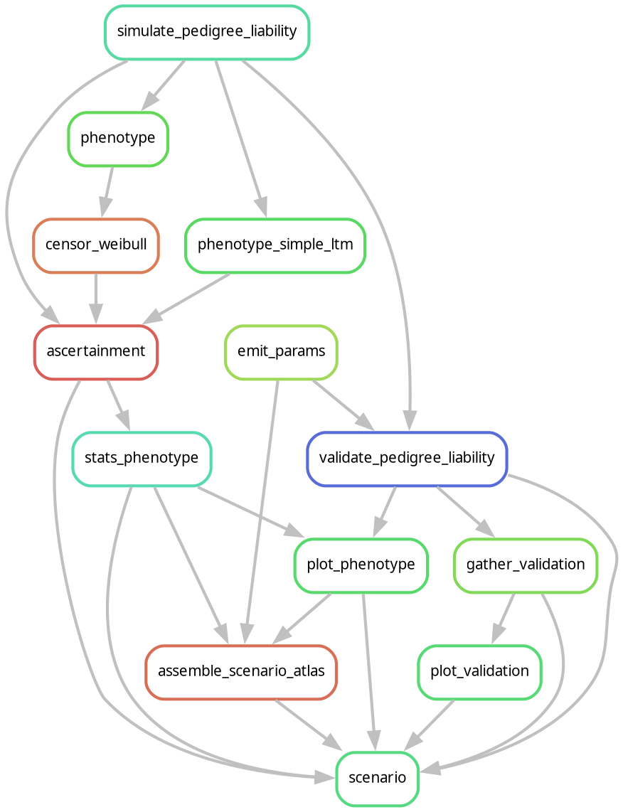

# Simulation Design

## Multi-generational pedigree

The simulation generates `G_sim` total generations:

- `G_sim - G_ped` are **burn-in** generations (simulated but not recorded)
- `G_ped` generations are recorded in the pedigree
- The last `G_pheno` of `G_ped` are phenotyped

Each generation contains `N` individuals. With default settings
($N = 100{,}000$, $G_{ped} = 6$), the recorded pedigree contains
approximately $600{,}000$ individuals.

## Mating and reproduction

In each generation, couples are formed from the potential parent pool
according to the following rules:

- An individual may participate in multiple couples.
- Males and females are paired randomly by default, or assortatively
  on liability via `assort1` and `assort2`.
- Offspring are distributed across matings by a multinomial draw.
- Population size is held constant; some couples produce no offspring.
- MZ twins are assigned to matings with two or more offspring.

At default settings (`mating_lambda = 0.5`), approximately 77% of
individuals have a single partner and 23% have two or more, producing
a natural mix of full sibs, maternal half-sibs, and paternal half-sibs.

## Pedigree relationship types

`PedigreeGraph` (from the [`pedigree-graph`](https://github.com/rwaples/pedigree-graph) package) extracts 23 relationship
categories from simulated pedigrees using sparse matrix algebra. Each type is
parameterised by `(up, down, n_ancestors)` -- meioses up from individual A to
common ancestor(s), meioses down to individual B, and whether the link is
through 1 (half/lineal) or 2 (full, mated-pair) ancestors. Kinship is
$n_{\text{ancestors}} \times (1/2)^{(\text{up} + \text{down} + 1)}$.

| Code | Label | Up | Down | Ancestors | Kinship | Degree |
|------|-------|---:|-----:|----------:|--------:|-------:|
| MZ | MZ twin | — | — | — | 1/2 | 0 |
| MO | Mother-offspring | 1 | 0 | 1 | 1/4 | 1 |
| FO | Father-offspring | 1 | 0 | 1 | 1/4 | 1 |
| FS | Full sib | 1 | 1 | 2 | 1/4 | 1 |
| MHS | Maternal half sib | 1 | 1 | 1 | 1/8 | 2 |
| PHS | Paternal half sib | 1 | 1 | 1 | 1/8 | 2 |
| GP | Grandparent | 2 | 0 | 1 | 1/8 | 2 |
| Av | Avuncular | 1 | 2 | 2 | 1/8 | 2 |
| GGP | Great-grandparent | 3 | 0 | 1 | 1/16 | 3 |
| HAv | Half-avuncular | 1 | 2 | 1 | 1/16 | 3 |
| GAv | Great-avuncular | 1 | 3 | 2 | 1/16 | 3 |
| 1C | 1st cousin | 2 | 2 | 2 | 1/16 | 3 |
| GGGP | Great²-grandparent | 4 | 0 | 1 | 1/32 | 4 |
| HGAv | Half-great-avuncular | 1 | 3 | 1 | 1/32 | 4 |
| GGAv | Great²-avuncular | 1 | 4 | 2 | 1/32 | 4 |
| H1C | Half-1st-cousin | 2 | 2 | 1 | 1/32 | 4 |
| 1C1R | 1st cousin 1R | 2 | 3 | 2 | 1/32 | 4 |
| G3GP | Great³-grandparent | 5 | 0 | 1 | 1/64 | 5 |
| HGGAv | Half-great²-avuncular | 1 | 4 | 1 | 1/64 | 5 |
| G3Av | Great³-avuncular | 1 | 5 | 2 | 1/64 | 5 |
| H1C1R | Half-1st-cousin 1R | 2 | 3 | 1 | 1/64 | 5 |
| 1C2R | 1st cousin 2R | 2 | 4 | 2 | 1/64 | 5 |
| 2C | 2nd cousin | 3 | 3 | 2 | 1/64 | 5 |

The `max_degree` parameter controls extraction depth (default 3, covering
through 1st cousins). It follows the registry degree exactly: degree 2 stops
at half-sibs, grandparents, and avuncular pairs; degree 3 adds 1st cousins
and the other degree-3 categories; degree 5 reaches 2nd cousins. The registry
is importable as `REL_REGISTRY` and `PAIR_KINSHIP` from `pedigree_graph`.

### Inbreeding and exact kinship

By default, relationship pairs carry the nominal `(up, down, n_ancestors)`
kinship, which assumes a single relationship path and no inbreeding. When
`estimate_inbreeding: true` is set in config, `PedigreeGraph` reports exact
values instead:

1. **`compute_inbreeding()`** returns per-individual inbreeding coefficients
   `F` via the Meuwissen–Luo ML ancestor-walk (`_compute_F_meuwissen_luo`). It
   does **not** build the full kinship matrix, and it is MZ-naive (twins are
   treated as full sibs). For non-consanguineous pedigrees every `F = 0`.

2. **`compute_pair_kinship(pairs)`** returns the *exact* kinship for each
   requested pair via a direct memoized recurrence
   (`pedigree_graph._kinship_pairwise`), computing only the requested pairs and
   never materializing the `n × n` matrix (it samples a cached
   `kinship_matrix(0.0)` only when one already exists). Exact kinship can exceed
   the nominal value because of inbreeding, MZ co-coalescence, **or multiple
   relationship paths** — e.g. double first cousins have kinship `0.125`, twice
   the nominal first-cousin `0.0625`. Its derived `F` is
   `phi(mother, father)` computed exactly as the kinship-matrix DP does, so it
   is MZ-aware (unlike the ML `compute_inbreeding`). There is no nominal fast
   path; see pedigree-graph ADR 0005.

The recurrence costs roughly `O(requested pairs + distinct ancestor-pairs
reached)` — far below the full-matrix build it replaced, which materialized a
near-dense `K` (≈53M nonzeros at 16K individuals) and OOM'd on large pedigrees.
The honest worst case is `O(P · A²)` in the max distinct-ancestor count `A`;
deeply inbred / high-overlap pedigrees are out of scope for the scaling
guarantee.

### K-free per-generation mean kinship

The coancestry-rate Ne estimator (`ne_coancestry`, `Ne_C`) needs only the
per-generation mean kinship `θ̄_g`, not the full sparse `K`.
`PedigreeGraph.per_gen_mean_kinship(min_kinship=0.0)` streams `θ̄_g`
directly from the kinship DP without materializing `K`'s CSC arrays.
This is the default path used by `compute_all_ne` unless
`analysis.skip_ne_coancestry` is set.

The streaming traversal walks each row of the DP's ascending-col-sorted
storage, counts each unordered same-generation non-twin pair once at
row index < col index, and accumulates a float64 sum per generation.
For N > ~3M at `G_ped=6` the K-build path is no longer viable
(`_assemble_csc`'s int32 nnz overflows); the streaming path scales to
much larger pedigrees because it never holds the full matrix at once.
Set `analysis.skip_ne_coancestry: true` to skip Ne_C and its DP entirely
when only the seven non-coancestry Ne estimators are needed.

## Pipeline stages

The simulation is conceptually split into four stages, plus downstream analysis:

1. **Simulate** -- generate multi-generational pedigree with ACE liability components
2. **Phenotype** -- map liability to age-of-onset via time-to-event models
3. **Censor** -- apply age-window and competing-risk mortality censoring
4. **Ascertainment** -- unified random dropout + case-weighted `N_sample` selection (per [ADR 0001](../adr/0001-unified-ascertainment-stage.md))

Followed by: validation (on the full pre-ascertainment pedigree), summary statistics, model fitting, and plotting.

## Pipeline rule graph

The Snakemake rule graph showing how rules feed into each other:



Regenerate the image after changes to the Snakefile or workflow rules:

```bash
scripts/regen_rulegraph.sh
```

The script writes `docs/images/rulegraph.png`. Pass an alternative target as
the first argument to render a different sub-DAG (default:
`results/test/small_test/scenario.done`).
