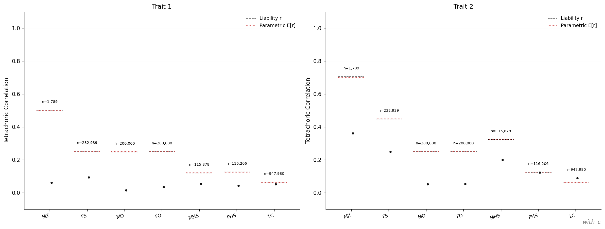

# Adding shared environment (C)

The [Minimal ACE](minimal-ace.md) baseline had $C = 0$ in both traits.
This page configures a single simulation containing two traits with
identical $A$ but contrasting shared-environment variance: trait 1 has
$C = 0$ and trait 2 has $C = 0.2$. The effect of the C component is
then read off the within-scenario trait 1 ↔ trait 2 comparison in the
atlas plots.

## Configuration

```yaml
with_c:
  seed: 90002
  replicates: 1
  pedigree:
    trait1:
      A: 0.5
      C: 0.0
      E: 0.5
    trait2:
      A: 0.5
      C: 0.2
      E: 0.3
```

Both traits have $A = 0.5$ and total variance $1.0$, so the input
heritability is $h^2 = 0.5$ in both. Trait 2 reassigns $0.2$ units of
variance from $E$ to $C$; cross-trait correlations $r_A$, $r_C$, $r_E$
default to zero, so the two traits are statistically independent.

## Run

```bash
snakemake --cores 4 results/examples/with_c/scenario.done
```

## Comparison between trait 1 and trait 2

The relative-pair correlation page from
`results/examples/with_c/plots/atlas.pdf`:



In simACE the C component is shared per household, where a household
is defined by the mother (`simace/simulation/simulate.py:761`). Full
siblings and maternal half-siblings therefore share C, whereas
parents and their offspring, paternal half-siblings, and cousins draw
C independently.

| Class | Trait 1 (C=0) | Trait 2 (C=0.2) | Trait 2 expectation       | Shares C?              |
| ----- | ------------- | --------------- | ------------------------- | ---------------------- |
| MZ    | 0.50          | 0.70            | $v_A + v_C = 0.70$        | yes                    |
| FS    | 0.25          | 0.45            | $0.5\,v_A + v_C = 0.45$   | yes (same mother)      |
| MO    | 0.25          | 0.25            | $0.5\,v_A = 0.25$         | no (different generation) |
| FO    | 0.25          | 0.25            | $0.5\,v_A = 0.25$         | no                     |
| MHS   | 0.125         | 0.325           | $0.25\,v_A + v_C = 0.325$ | yes (same mother)      |
| PHS   | 0.125         | 0.125           | $0.25\,v_A = 0.125$       | no (different mothers) |
| 1C    | 0.0625        | 0.0625          | $0.0625\,v_A = 0.0625$    | no                     |

The variance-component checks in `validation.yaml` recover $(0.5, 0.0,
0.5)$ for trait 1 and $(0.5, 0.2, 0.3)$ for trait 2, in agreement with
the configured inputs.

## Observations

### Observation 1 — C inflates only the relative classes that share a mother

MZ, FS, and MHS each gain exactly $v_C = 0.2$ between trait 1 and trait
2; MO, FO, PHS, and 1C are unchanged. The increment is the same in
every class that shares C, regardless of the additional contribution
from the additive component, because the C component is shared in full
or not at all.

### Observation 2 — The MZ–FS gap is invariant to $v_C$

The difference $r_{MZ} - r_{FS} = 0.5 \, v_A$ is independent of $v_C$,
because both MZ and FS share C in full and the $v_C$ term cancels.
Consequently, Falconer's formula $2(r_{MZ} - r_{FS})$ estimates $h^2$
rather than $h^2 + c^2$, and both traits return $\approx 0.5$ from
Falconer despite their materially different relative-pair correlation
patterns.

### Observation 3 — The MHS–PHS contrast is a direct estimator of $v_C$

Maternal and paternal half-siblings share the same $0.25 \, v_A$ by
relatedness; the only structural difference between them in this model
is that MHS share C and PHS do not. It follows that
$r_{MHS} - r_{PHS} = v_C$ exactly. The trait 2 panel gives
$0.325 - 0.125 = 0.20$, matching the configured input; the trait 1
panel gives $0$, also as expected. This contrast is the identifiability
condition that allows the ACE model to separate $v_C$ from $v_E$ (see
the [ACE Model concept page](../concepts/ace-model.md)), and it relies
on the maternal household structure used by simACE.

The case in which the clean C decomposition breaks — for example,
under assortative mating, which moves variance into a covariance
between mates — is treated in
[AM and Heritability](am-and-heritability.md).
