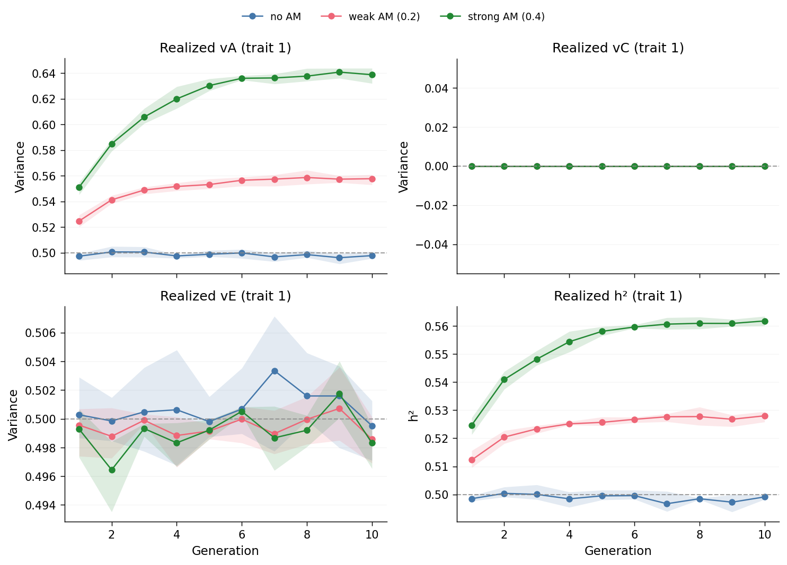
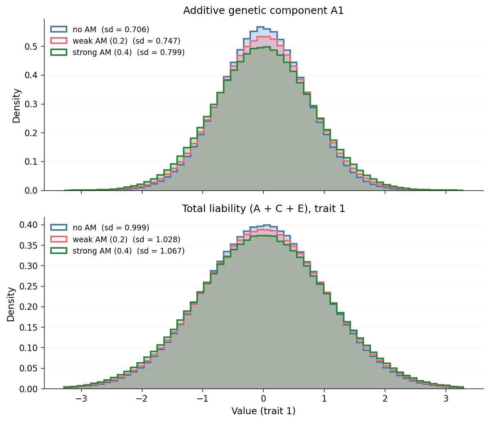
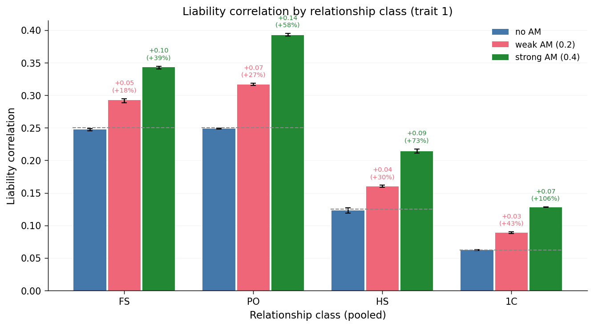
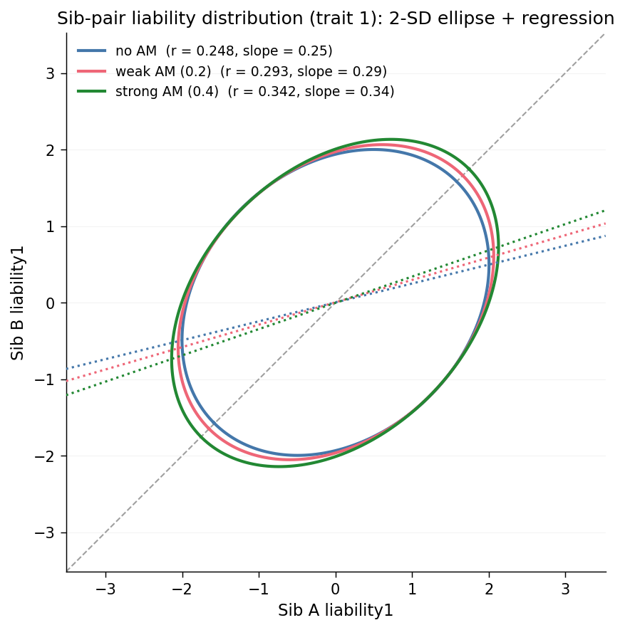
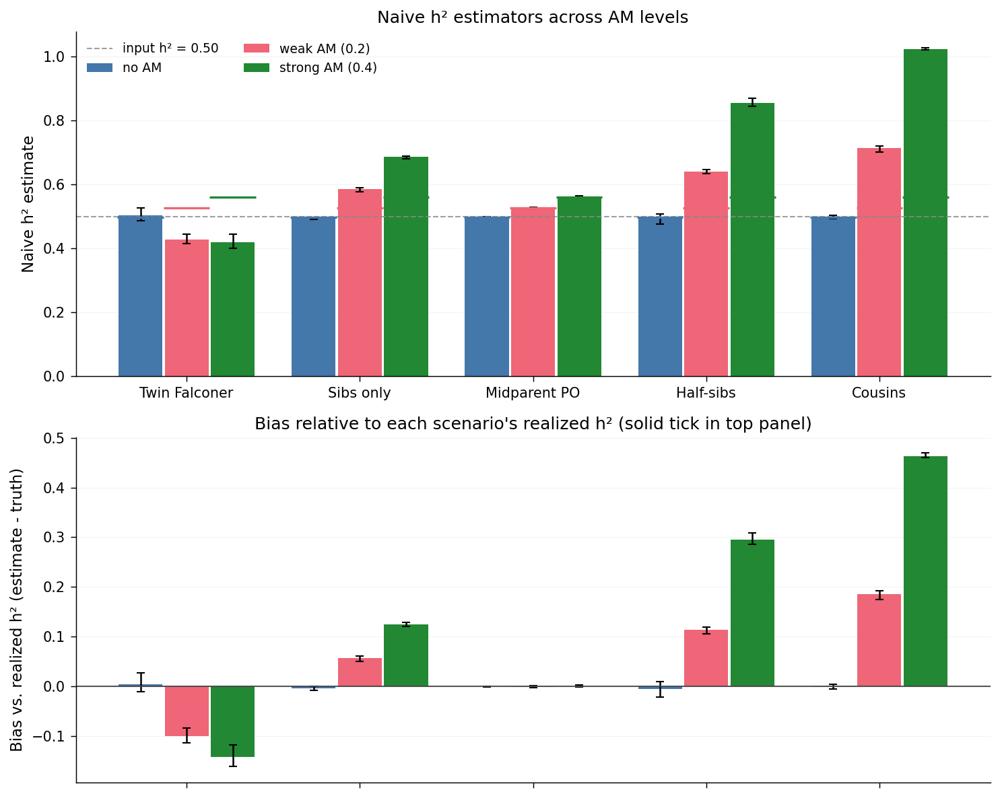

# Assortative mating and heritability

Assortative mating (AM) is when mates are more similar on some trait than you'd
expect by chance. Positive AM on a heritable trait couples the trait's genetic
values across mates, and the coupling propagates to their offspring. Over
generations, that reshapes the population's additive genetic variance, the
correlations between relatives, and anything an investigator estimates from
those correlations. This page walks through three distinct ways that plays
out in the simACE output of a single set of scenarios.

The [ACE Model](../concepts/ace-model.md) page explains the variance
decomposition used throughout.

## Scenarios

All three scenarios use a lognormal cure-frailty phenotype model on trait 1
(`model: cure_frailty`, `distribution: lognormal`, `mu=3.5`, `sigma=0.7`,
`beta=1.0`, `beta_sex=0.0`, `prevalence=0.1`), identical variance inputs
(A=0.5, C=0.0, E=0.5 for trait 1 — no shared-environment component and no sex
effect on hazard, so the story stays about vA vs vE), and differ only in the
AM coefficient on trait 1.

| Scenario    | `assort1` | `assort2` | N       | G_ped | G_pheno | G_sim | reps |
| ----------- | --------- | --------- | ------- | ----- | ------- | ----- | ---- |
| `am_none`   | 0.0       | 0.0       | 100,000 | 10    | 10      | 10    | 3    |
| `am_weak`   | 0.2       | 0.0       | 100,000 | 10    | 10      | 10    | 3    |
| `am_strong` | 0.4       | 0.0       | 100,000 | 10    | 10      | 10    | 3    |

Rebuild all three (and the comparison plots on this page) with:

```bash
snakemake --cores 4 examples_all
```

## Claim 1 — AM inflates realized vA at equilibrium

The input values `A=0.5, C=0.0, E=0.5` describe the variance decomposition in
an idealized founder generation drawn under random mating: half of the
liability variance is heritable and half is unique environment. With positive
AM, mates correlate on the *genetic* component of the liability. Under
standard quantitative-genetic theory, that correlation feeds an increase in
the between-locus linkage disequilibrium, and the population's realized
additive variance grows over generations until a new equilibrium is reached.
The realized $h^2 = v_A / (v_A + v_E)$ that any estimator should recover is
then *higher* than the input $0.5$ — the estimator is not being biased; the
population itself has moved.

`validation.yaml` records the per-generation realized ACE components for every
replicate, so we can see this directly:



Read the top-left panel first. The grey dashed line is the simulation input
($v_A = 0.5$). The `am_none` trace sits on that line across all 10 generations
(sampling noise only). The `am_strong` trace drifts upward — each generation
adds a small amount of shared genetic similarity between mates, and the
cumulative effect on population vA is visible by generation 4–5 and stabilizes
by generation 10. The `am_weak` trace sits in between.

The top-right panel ($v_C$) is a flat line at zero for all three scenarios, by
construction: we set C = 0 so the story is cleanly about how AM redistributes
variance between A and E. The bottom-right panel turns $v_A$ and $v_E$ into
realized $h^2$: because $v_E$ stays close to its input value, inflation of
$v_A$ flows directly into inflation of $h^2$. The *same* input ACE parameters
can produce materially different "true" heritabilities depending on the mating
system.

The shaded band around each line is the min/max across the three replicates.
It's tighter than it looks at a glance — at N=100,000 per generation the
sampling variance of $v_A$ is small.

The trajectory plot shows the variance components as time-series *numbers*.
The same effect is also visible as a change in the actual per-individual
distributions at equilibrium. Pooling all individuals in the last 5
generations (gens 5–9), we can overlay the distribution of the additive
genetic component $A_1$ (top) and the total liability $A_1 + C_1 + E_1$
(bottom) across the three AM scenarios:



Both panels widen from `am_none` → `am_weak` → `am_strong`. The top panel
shows that AM directly stretches the *additive genetic* distribution — the
legend's standard deviations quantify the same inflation the top-left panel
of the trajectory plot shows. The bottom panel shows that the A-inflation
propagates straight through to the total phenotype: since $C_1 = 0$ and $E_1$
is fixed by construction, the liability distribution widens by exactly the
amount $A_1$ did. Every panel in Claim 1 is ultimately telling the same
story; the histograms just make it a shape-level fact rather than a
variance-component number.

## Claim 2 — AM distorts the similarity pattern among relatives

Claim 1 showed that AM moves the population's variance components. Claim 2 is
its direct phenotypic consequence: AM also distorts the *pattern* of
similarity across relatives, and the distortion looks different depending on
which slice of the pedigree you look at. That matters because most practical
heritability estimators (twin-study Falconer, pedigree regressions,
variance-component REML) lean on the *structure* of these correlations — they
assume that the correlation between relatives of kinship $k$ should be
$k \cdot v_A + c \cdot v_C$. Break the structure and the estimator silently
drifts. Below we show the distortion two ways: first as a relationship-class
summary (how much each kinship inflates), then as the raw joint distribution
(how that inflation looks as a shape change in sib-pair liability space).

### By relationship class

All correlations on this page are computed on the **last 5 generations** of
each pedigree (`generation >= G_pheno / 2`, so gens 5 through 9 for our
G_pheno=10 configuration). By that point the AM-induced inflation of
$v_A$ has approximately stabilized (see Claim 1's trajectory plot), so this
filter isolates the equilibrium behavior from the early-generation transient.
Pair extraction uses the *full* pedigree so that cousins of later-gen
individuals can still be found via their grandparents in earlier gens; only
the correlation calculations themselves use the filtered subset.

We group relative pairs into seven raw classes (MZ twins, full sibs,
mother-offspring, father-offspring, maternal half sibs, paternal half sibs,
first cousins). MZ twins are left off this chart — their liability
correlation is pinned at $A + C$ regardless of AM, so they only crowd the
y-axis. For the remaining classes we pool maternal/paternal pairs into a
single PO and HS class, giving four classes on the x-axis of the chart
below.



The grey dashed lines are the random-mating expectations for our input
($A = 0.5, C = 0$): $0.5 \cdot A$ for FS and PO, $0.25 \cdot A$ for HS, and
$0.125 \cdot A$ for 1C. Above each non-baseline bar, a small label reports
the absolute inflation ($\Delta r$) and the relative inflation (percent
change) versus the `am_none` baseline for that relationship class — so you
can read both the qualitative pattern and the exact numbers off the same
chart. Read the chart from left to right:

- **FS and PO** both inflate under AM, and by visibly similar amounts — both
  hinge on a single shared parent-to-offspring transmission step, and AM
  inflates the additive variance that passes through it.
- **HS** inflate too, but less — they share only one parent, so only one
  parent's AM-correlated genotype contributes to the shared liability.
- **1C** inflate least in absolute terms but proportionally the most relative
  to their no-AM baseline.

A Falconer-style estimator takes two of these numbers, subtracts, and scales
to get $h^2$. Under random mating, $h^2 \approx 2(r_{MZ} - r_{DZ})$ and
$h^2 \approx 2 \cdot r_{PO}$ give the same answer. Under AM they don't:
$r_{MZ}$ is pinned, $r_{DZ}$ inflates, $r_{PO}$ also inflates — so the two
formulas diverge, and neither recovers the realized $h^2$ that Claim 1
showed is itself moving.

### As a joint-distribution shape change

The bar chart summarizes similarity as a single number per class. The same
effect is also visible as a change in the *shape* of the joint liability
distribution of relatives. For full sibs, we take every non-twin full-sib
pair, sample the liability of the first two children per family (by `id`
order), and summarize the bivariate distribution of those pairs with two
shapes: the 2-SD covariance ellipse (≈95% of the density under a Gaussian
approximation) and the best-fit regression line of sib-B liability on
sib-A liability. Founders are excluded (no parents), MZ twins are excluded
(they'd pile directly on y=x by construction), and we use the same
last-5-generation filter as the bar chart above so both views tell their
story at AM equilibrium.



The chart overlays, on a single axis, three 2-SD covariance ellipses
(approximately the 95% contour of the joint sib-pair liability distribution
under a Gaussian fit) and the three best-fit regression lines of sib-B on
sib-A, one per scenario. The grey dashed line is y=x. The legend labels each
scenario with its Pearson $r$ and the slope of its regression line.

From `am_none` to `am_strong`, two things grow in lockstep: the ellipse's
long axis stretches further along the y=x direction (the cloud becomes more
elongated), and the regression line rotates upward (the slope increases from
about 0.25 at random mating to about 0.34 under strong AM). A taller slope
means "a sib above the mean predicts more extra above-mean in the other sib"
— that's the phenotypic fingerprint of the AM-inflated FS correlation shown
in the bar chart above, and of the AM-inflated additive variance from
Claim 1. Three views, one phenomenon. Claim 3 picks up the estimator-bias
thread.

## Claim 3 — AM biases naive estimators that assume random mating

Claims 1 and 2 set up the two things that go wrong under AM: the population's
realized $v_A$ (and with it the realized $h^2$) has moved above the input
value, and the correlation between relatives has inflated by a
class-dependent amount. A "naive" heritability estimator — one that maps a
single pedigree correlation (or regression slope) to $h^2$ under the
assumption of random mating — is therefore doomed to mismatch the truth
under AM. The question is just *by how much*, and *in which direction*, for
each estimator.

We run five textbook estimators on each scenario:

- **Twin Falconer**: $h^2 = 2 \cdot (r_{MZ} - r_{FS})$
- **Sibs only**: $h^2 = 2 \cdot r_{FS}$
- **Midparent PO**: $h^2 = $ slope of offspring liability regressed on mean
  of parent liabilities
- **Half-sibs**: $h^2 = 4 \cdot r_{HS}$
- **Cousins**: $h^2 = 8 \cdot r_{1C}$

Each of these recovers $h^2$ under random mating. Under AM, each is
contaminated by the AM-induced inflation of the correlation it hinges on —
but by different amounts, because the inflation per class differs (see
Claim 2). As in Claim 2, all correlations, the midparent-offspring
regression slope, and the realized-$h^2$ reference are computed on the
last 5 generations of each pedigree (`generation >= G_pheno / 2`, so gens
5 through 9 at G_pheno=10). This isolates the AM equilibrium; pair
extraction still uses the full pedigree so that cousins of later-gen
individuals can be found via their earlier-gen grandparents, and the
midparent regression reads parent liabilities from the full pedigree even
when the parents themselves sit in earlier gens.



The **top panel** shows each estimator's raw output per scenario. Short
solid horizontal ticks, colored to match each scenario's bars, mark that
scenario's *realized* $h^2$ (the final-generation $v_A / (v_A + v_C + v_E)$
from Claim 1). The grey dashed line is the *input* $h^2 = 0.50$.

The **bottom panel** recasts the top as signed bias: each bar is the per-rep
estimator value minus that rep's realized $h^2$, averaged across reps. The
horizontal line at zero is "agrees with realized truth." Bars above zero
overestimate, bars below underestimate.

### By estimator

Three patterns jump out:

- **`am_none` calibrates cleanly.** Every estimator sits on top of the
  realized-$h^2$ tick in the top panel and has near-zero bias in the bottom
  panel. The naive formulas work exactly as advertised when their
  random-mating assumption is satisfied.
- **Midparent-offspring regression is nearly AM-robust.** Even under
  `am_strong`, the midparent-PO slope tracks the realized $h^2$ to within a
  sampling-noise tolerance. This is the classical result that the
  midparent-offspring regression recovers $h^2$ at equilibrium more or less
  regardless of mating structure, because the regressor already pools the
  two AM-correlated parental genotypes.
- **Cousins-only explodes.** Because its multiplier is $8\times$, even the
  modest inflation of $r_{1C}$ under AM balloons to a large absolute bias —
  the strong-AM estimate approaches 1.0, well above the realized $h^2 \approx
  0.56$. Half-sibs ($4\times$) drift less than cousins but more than sibs
  ($2\times$); the bias is monotone in the kinship multiplier.

### The diagnostic signature

The divergence across estimators is itself the diagnostic signal of AM. If
you have access to correlations across multiple kinship classes and they
yield wildly inconsistent $h^2$ estimates, the population is telling you
that the random-mating assumption underlying the naive formulas is wrong.
That's Claim 3's takeaway for a practitioner: naive $h^2$ estimators look
sensible in isolation but are only trustworthy when their outputs agree.
Disagreement means the kinship structure the estimator assumed is not the
kinship structure you actually have.
