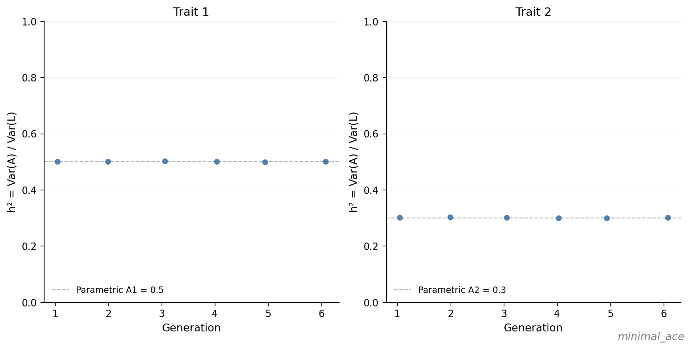
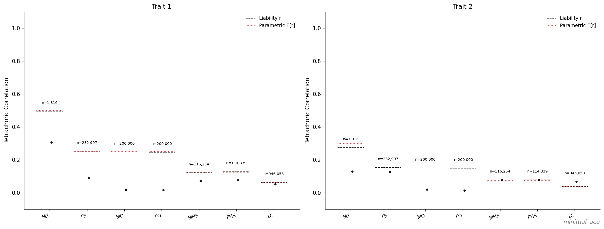

# Minimal ACE

The minimal configuration that exercises the full pipeline: two traits, no
shared environment, no assortative mating, and the default phenotype model.
The purpose is to verify that the simulator places variance where the
configuration specifies, at two distinct heritabilities, before any
deviation from the standard ACE model is introduced.

## Configuration

The following block is added to `config/examples.yaml`:

```yaml
minimal_ace:
  seed: 90001
  replicates: 1
  pedigree:
    trait1:
      A: 0.5
      C: 0.0
      E: 0.5
    trait2:
      A: 0.3
      C: 0.0
      E: 0.7
```

All other parameters (population size, generation counts, censoring,
phenotype model) inherit from `config/_default.yaml`. Total variance is
$1.0$ for each trait, so the input heritabilities are $h^2_1 = 0.5$ and
$h^2_2 = 0.3$. Both traits have $C = 0$ and zero cross-trait correlation,
so they constitute two independent calibration targets within the same
simulation.

## Run

```bash
snakemake --cores 4 results/examples/minimal_ace/scenario.done
```

## Observations

The per-scenario atlas at `results/examples/minimal_ace/plots/atlas.pdf`
contains two pages relevant to calibration. In each figure below the
left panel corresponds to trait 1 ($h^2_1 = 0.5$) and the right panel
to trait 2 ($h^2_2 = 0.3$).

### Observation 1 — Realized $h^2$ matches the input across generations



For each generation the realized $\text{Var}(A) / \text{Var}(L)$ falls
on the dashed parametric line at $0.5$ (trait 1) and $0.3$ (trait 2).
In the absence of selection, assortative mating, and time-varying
components, the variance ratio is invariant across generations, in
agreement with the configured input.

### Observation 2 — Liability correlations match ACE expectations across relative classes



In both panels, the dashed liability-$r$ bars coincide with the dotted
parametric expectations across all seven relative classes:

| Class       | Trait 1 ($h^2 = 0.5$) | Trait 2 ($h^2 = 0.3$) |
| ----------- | --------------------- | --------------------- |
| MZ          | $\approx 0.50$        | $\approx 0.30$        |
| FS, MO, FO  | $\approx 0.25$        | $\approx 0.15$        |
| MHS, PHS    | $\approx 0.125$       | $\approx 0.075$       |
| 1C          | $\approx 0.0625$      | $\approx 0.0375$      |

Each entry equals the relatedness coefficient (1, ½, ¼, ⅛) multiplied
by $h^2$. The MZ–FS gap equals $h^2/2$ in both panels, corresponding
to the quantity that Falconer's formula $2(r_{MZ} - r_{FS})$ doubles in
order to recover $h^2$.

MZ is the limiting class for twin-based heritability estimators: at
$N = 100{,}000$ and a twin rate of $\approx 0.012$, only $n \approx 1{,}800$
MZ pairs are available, compared with $n \approx 230{,}000$ full-sib
pairs. As a result, the single-replicate MZ–FS Falconer estimate in
`validation.yaml` is visibly noisier than the realized $h^2$ in
Observation 1, even though both target the same quantity.

The black dots are tetrachoric correlations computed on binary affected
status under the default Weibull frailty phenotype model. They sit
systematically *below* the liability-$r$ bars because the Weibull
frailty model lacks an explicit threshold structure; this regime is
treated separately in [Observed vs Liability h²](observed-vs-liability-h2.md).

## Summary

Variance components are recovered, the relative-pair correlation
structure matches ACE expectations, and Falconer's identity holds in
expectation, simultaneously at two distinct heritabilities. Subsequent
examples introduce specific deviations from this baseline: a non-zero
shared-environment component
([Adding shared environment (C)](adding-shared-environment.md)),
assortative mating ([AM and Heritability](am-and-heritability.md)),
alternative phenotype models
([Observed vs Liability h²](observed-vs-liability-h2.md)), and
time-varying $E$ ([Time-varying E and h² drift](time-varying-e.md)).

The full set of output files produced by one run is described in
[Output Structure](../user-guide/output-structure.md).
