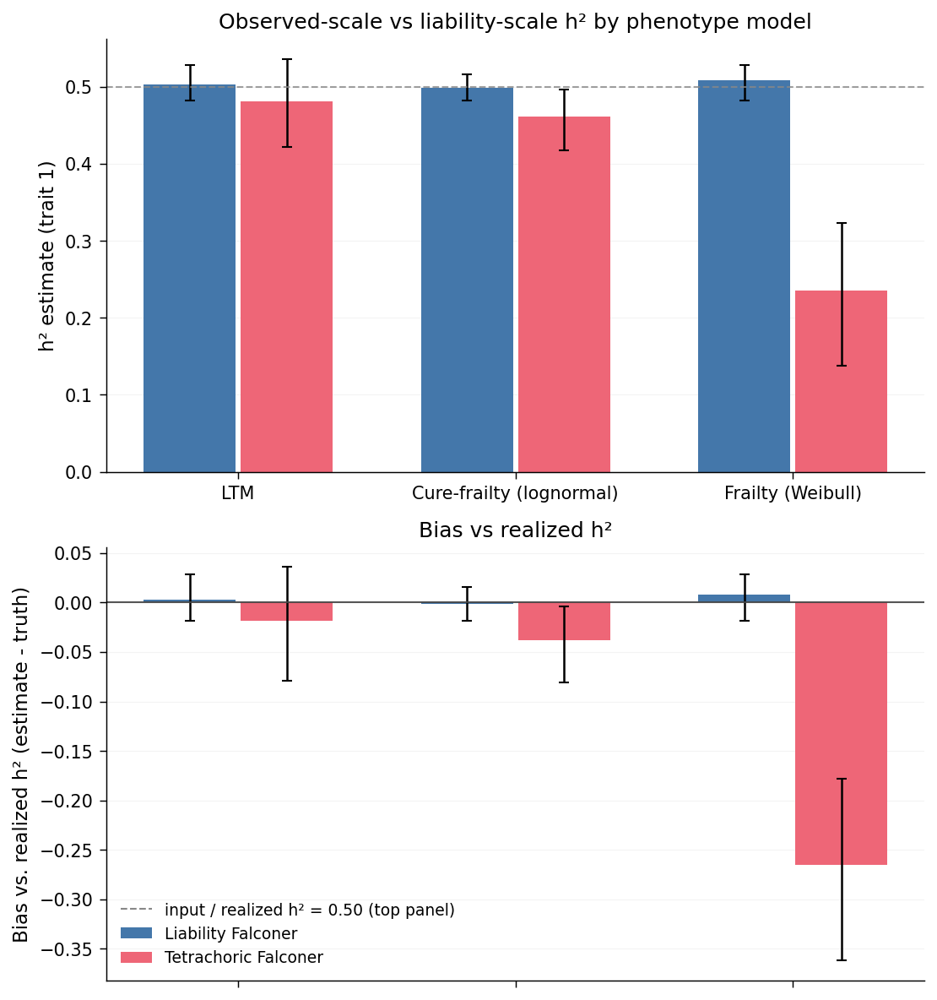

# Observed-scale vs liability-scale heritability

In quantitative genetics, $h^2 = v_A / (v_A + v_C + v_E)$ is defined on the
*liability* scale — the continuous latent trait whose threshold crossings
(or whose hazard trajectories) produce the observable phenotype. In real
data the liability is almost never directly observed; what you see is a
binary affected / unaffected status, possibly with age of onset. Recovering
liability-scale $h^2$ from that observed signal requires an assumed mapping
between the two, and the mapping depends on the **phenotype model** that
generated the observation.

This page compares three phenotype models under otherwise-identical ACE
truth, to show when a tetrachoric-based estimator on binary data recovers
liability-scale $h^2$ and when it doesn't.

## Scenarios

All three scenarios share:

- $A_1 = 0.5$, $C_1 = 0.0$, $E_1 = 0.5$ → input $h^2 = 0.5$
- No assortative mating (assort1 = assort2 = 0)
- $N = 100{,}000$ founders, $G_{ped} = G_{pheno} = G_{sim} = 10$, 3 replicates
- Target prevalence $K \approx 0.1$; observed $K \approx 0.06$ in all three
  scenarios (comparable across models, which is what matters for the
  comparison)
- No sex effect on hazard ($\beta_{sex} = 0$), liability-to-hazard coupling $\beta = 1.0$

They differ only in the **phenotype model family** used to map the latent
liability to an observed affection status:

| Scenario                  | Model                                 | Params                                         |
| ------------------------- | ------------------------------------- | ---------------------------------------------- |
| `model_ltm`               | `adult`, `method: ltm`                | `cip_x0 = 16.3`, `cip_k = 0.376`               |
| `model_cure_frailty_ln`   | `cure_frailty`, `distribution: lognormal` | `mu = 3.5`, `sigma = 0.7`                  |
| `model_frailty_wb`        | `frailty`, `distribution: weibull`    | `scale = 2160`, `rho = 0.8`                    |

The LTM scenario is the classical liability-threshold model: an individual
is affected iff their liability exceeds a sex-/age-specific threshold. The
frailty scenarios instead treat liability as the log-hazard of an
age-of-onset process; whether an individual is "affected" at the end of
their observation window depends on liability *and* on time. Cure-frailty
adds a *susceptibility* fraction on top: only a subset of individuals is
at risk at all, and the hazard governs onset within that subset.

Rebuild all three (and every other docs-embedded comparison plot) with:

```bash
snakemake --cores 4 examples_all
```

## Claim — Tetrachoric Falconer depends on the *shape* of the liability→observed map

Two estimators of $h^2$ are applied to each scenario:

- **Liability Falconer** $= 2 \cdot (r_{MZ}^{\text{liab}} - r_{FS}^{\text{liab}})$,
  computed on the *continuous* simulated liability. In real data you can't
  do this — it requires access to the latent trait. Here it plays the role
  of an oracle reference: what the Falconer formula returns when fed the
  "right" correlation inputs.
- **Tetrachoric Falconer** $= 2 \cdot (r_{MZ}^{\text{tetra}} - r_{FS}^{\text{tetra}})$,
  computed from tetrachoric correlations on *binary* affected status.
  Tetrachoric assumes a bivariate-normal liability under a single
  threshold mapping; how well that assumption matches the data-generating
  process is what decides whether the estimate is right.

The claim: under `model_ltm` and `model_cure_frailty_ln`, tetrachoric
Falconer approximately recovers the realized $h^2$. Under `model_frailty_wb`
it severely underestimates, because pure frailty lacks the "threshold"
structure (either a hard liability cutoff or a susceptibility fraction)
that tetrachoric is built around.



The **top panel** shows each estimator's raw output per scenario. The
dashed grey line is the input $h^2 = 0.50$; it doubles as the realized-$h^2$
reference here because there is no AM to push the population off the input
value (if realized had diverged, a short dark-grey tick would be drawn at
its actual location for that scenario).

The **bottom panel** recasts the top as signed bias: each bar is the per-rep
estimator value minus that rep's realized $h^2$.

### What to read off

- **Under LTM**, liability-Falconer and tetrachoric-Falconer sit essentially
  on top of each other and both land within sampling noise of realized
  $h^2$. The classical textbook result: when the data *were* generated by
  a liability-threshold model, tetrachoric on binary outcomes recovers
  the underlying continuous correlation structure and Falconer's formula
  gives the right $h^2$.
- **Under cure-frailty**, tetrachoric *also* recovers realized $h^2$ (with
  slightly more residual bias than LTM, but within the same order of
  magnitude). The cure fraction — a hard susceptibility cutoff — acts as
  an implicit threshold on the liability, which is the regime tetrachoric
  was designed for. So a mixture model with a distinct at-risk/not-at-risk
  split looks LTM-like from the outside.
- **Under pure Weibull frailty**, tetrachoric drops to about half of
  realized $h^2$. With no cure fraction, every individual is at some risk
  and the "affected" indicator is a smooth non-threshold function of
  liability (integrated hazard over an observation window). That smooth
  mapping compresses the correlation gap between MZ twins and full sibs:
  the underlying liability correlations are the same as the other
  scenarios (~0.50 MZ, ~0.25 FS), but their tetrachoric projections
  onto binary status are much closer together (~0.27 MZ, ~0.15 FS), so
  $2 \cdot (r_{MZ} - r_{FS})$ comes out low.

### The practitioner's takeaway

Tetrachoric-based $h^2$ estimates assume the phenotype is a threshold
function of a bivariate-normal liability. LTM satisfies that exactly, and
cure-frailty satisfies it "close enough" (the susceptibility indicator is
itself a threshold-like variable). For genuinely smooth age-of-onset traits
with no distinguishable at-risk subgroup, the tetrachoric approach
systematically under-estimates liability-scale $h^2$. In that regime, an
age-of-onset-aware method (PAFGRS, EPIMIGHT, first-passage-time) is not a
luxury — it's a necessary correction.
