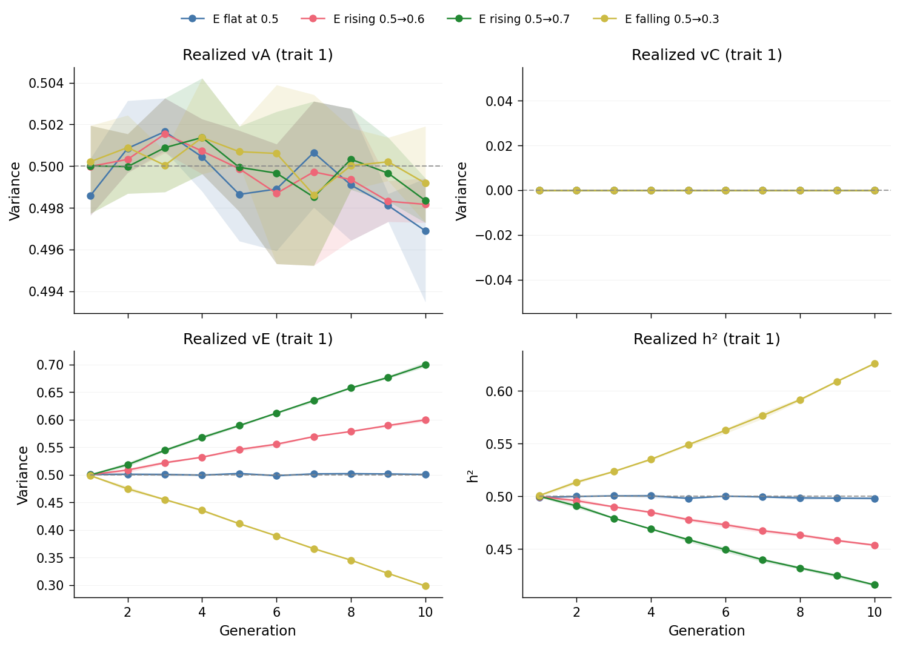
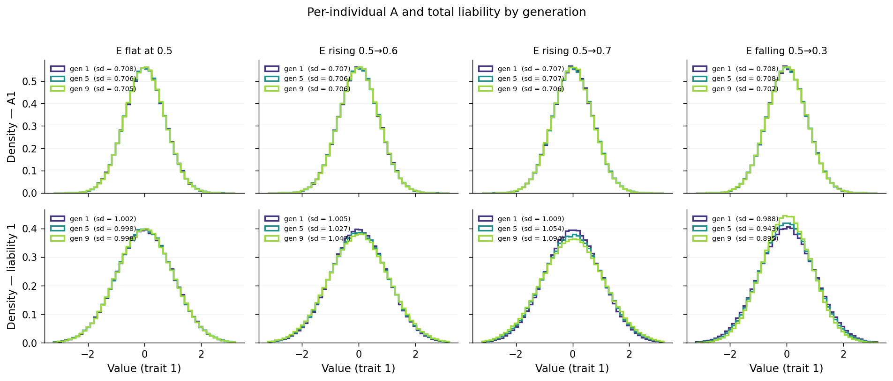
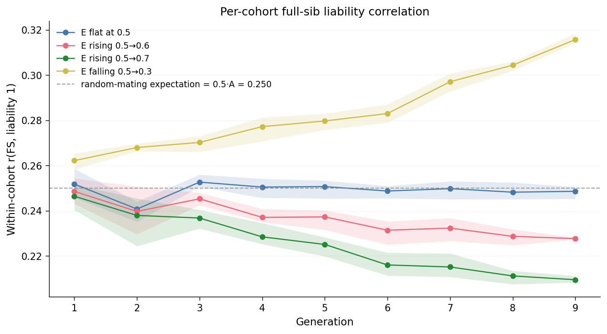
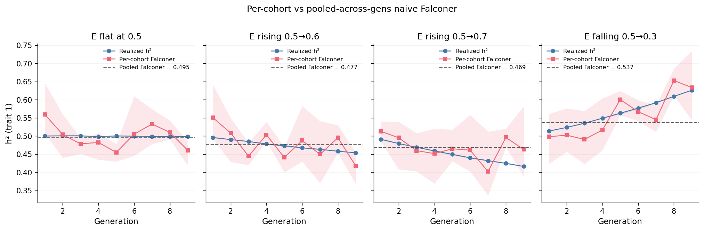
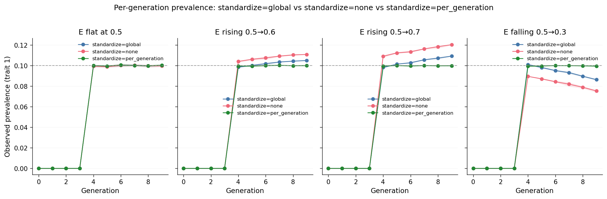

# Time-varying E and h² drift

A core assumption of the standard ACE model is that the variance components
are *constants* of the population — fixed numbers attached to the trait,
inherited from generation to generation as if they were physical constants
of the trait itself. They aren't. Real environments shift across cohorts:
education, urbanization, diet, screening practices, public-health
interventions, and many other things change the typical magnitude of the
non-genetic, non-shared-environment contribution to a trait. When the
unique-environment variance $v_E$ moves across generations, the realized
heritability $h^2 = v_A / (v_A + v_C + v_E)$ moves with it — even when
nothing about $v_A$ has changed. This page walks through what that drift
looks like in simACE output, how it shows up in within-cohort
relative-pair correlations, how a naive heritability estimator pooled
across cohorts mis-aggregates the moving truth, and how the choice of
the `standardize` configuration flag determines whether observed-scale
prevalence stays put or drifts in lockstep.

The [ACE Model](../concepts/ace-model.md) page explains the variance
decomposition. The [AM and Heritability](am-and-heritability.md) page
covers a different way the population can move off its inputs (mating
system); this page treats the temporal axis instead. Both pages share the
same fundamental warning: the input numbers and the realized numbers can
disagree, and naive estimators don't know which one they're reporting.

## Scenarios

All eight scenarios use a liability-threshold (`adult` / `method: ltm`)
phenotype model on trait 1 with `cip_x0=16.3`, `cip_k=0.376`,
`prevalence=0.1`, `beta=1.0`, `beta_sex=0.0`, identical $A_1=0.5$,
$C_1=0.0$, no AM, $N=100{,}000$, $G_{ped}=G_{pheno}=10$, 3 replicates.
**All scenarios start at $E_1 = 0.5$ in generation 0**, so the gen-0
founder state is identical across them.

The four E trajectories differ in how $E_1$ moves across generations 0–9:

| Trajectory       | $E_1$ schedule (linear, gen 0 → gen 9) |
| ---------------- | -------------------------------------- |
| `e_flat`         | 0.5 constant                           |
| `e_rise_mild`    | 0.5 → 0.6 (Δ = +0.1)                   |
| `e_rise_steep`   | 0.5 → 0.7 (Δ = +0.2)                   |
| `e_fall_steep`   | 0.5 → 0.3 (Δ = −0.2)                   |

Each trajectory has a `_std` and `_nostd` variant with **matched seeds**:
the simulated liability columns are byte-identical within a pair; only the
binary affected status (in `phenotype.parquet`) differs. Claims 1–3 use
the four `_std` scenarios only because they're statements about the
liability scale, where the standardize flag is invisible. Claim 4
contrasts `_std` against `_nostd` because that's exactly the
observed-scale axis.

Rebuild all four (and the comparison plots on this page) with:

```bash
snakemake --cores 4 examples_all
```

## Claim 1 — Realized $v_E$ tracks the configured trajectory; $h^2$ drifts with it

The simulator computes the per-generation $E_1$ values from the dict in
the config, draws independent normal noise of the corresponding variance
for every individual in that generation, and adds it to the genetic
component to form the liability. So *if the simulator is doing what it
says*, the realized $v_E$ recovered from the per-individual liability
columns should track the input schedule one-for-one; $v_A$ should sit
flat at the input 0.5 (no AM, no selection); and $h^2 = v_A/(v_A+v_E)$
should drift inverse to $v_E$.

`validation.yaml` records the per-generation realized ACE components for
every replicate, so we can see this directly:



(A note on gen indexing: simACE stores 0-indexed generations in
`pedigree.parquet` (gens 0–9 for `G_pheno=10`) but labels them 1-indexed
in `validation.yaml` (`generation_1` … `generation_10`). The trajectory
plot here reads `validation.yaml` so its x-axis is 1–10, with **gen 1 =
founders**. The cohort plots later on this page (FS correlation,
Falconer, components-by-generation) read `pedigree.parquet`, so their
x-axis is 0–9 with **gen 0 = founders**. In both cases gen "$N$" is the
same physical cohort under a different label; the figures just inherit
the indexing of the file they read.)

Read the bottom-left ($v_E$) panel first. The horizontal grey dashed
line at 0.5 is the `e_flat` reference schedule, drawn for visual
calibration. Each solid trace tracks its scenario's *configured*
schedule essentially perfectly, with sampling noise smaller than the
line thickness at $N=100{,}000$ per generation: `e_flat` sits flat at
0.5, the rising scenarios climb in straight lines toward 0.6 / 0.7,
`e_fall_steep` declines symmetrically toward 0.3.

The top-left ($v_A$) panel is flat at 0.5 across *every* scenario, by
construction: $A$ is constant in the config and there's no AM or selection
to redistribute it. The top-right ($v_C$) panel is flat at zero, again by
construction. Both confirm that the trajectory of $v_E$ is the *only*
component moving across generations.

The bottom-right ($h^2$) panel is the consequence: with $v_A$ fixed and
$v_C = 0$, $h^2 = 0.5 / (0.5 + v_E)$. Plug in the per-gen $v_E$ values
and the $h^2$ trajectories trace mirror images of the $v_E$ panel. At
the final generation:

- `e_flat` ≈ 0.500 (input, unchanged)
- `e_rise_mild` ≈ 0.455 ($h^2$ fell by ~0.045)
- `e_rise_steep` ≈ 0.417 ($h^2$ fell by ~0.083)
- `e_fall_steep` ≈ 0.625 ($h^2$ *rose* by ~0.125)

The same input ACE parameters can produce materially different "true"
heritabilities across generations of one population — and this is purely
a temporal/cohort effect, with nothing AM-like, no selection, no
environmental cross-transmission.

The trajectory plot shows the variance components as time-series
*numbers*. The same effect is also visible as a change in the actual
per-individual distributions across generations. Sampling three
representative cohorts (gen 1, gen 5, gen 9) and overlaying their
distributions of $A_1$ (top) and total liability $A_1 + E_1$ (bottom)
gives:



Top row (A) is the calibration check: $A_1$ is constant by config, so
all three generations should have indistinguishable distributions in
*every* scenario. They do — SDs sit between 0.705 and 0.708 across all
12 (scenario × generation) cells in the top row, well within sampling
noise.

Bottom row (total liability) is where the story is:

- **`e_flat`**: all three gen curves overlap at SD ≈ 1.00. No drift.
- **`e_rise_mild`**: gen 1 SD ≈ 1.005, gen 5 ≈ 1.027, gen 9 ≈ 1.047.
  Visible widening as later cohorts pick up more E variance.
- **`e_rise_steep`**: gen 1 ≈ 1.009 → gen 9 ≈ 1.094. Wider swing; the
  gen 9 curve is visibly flatter at the peak and fatter in the tails.
- **`e_fall_steep`**: gen 1 ≈ 0.988 → gen 9 ≈ 0.895. Reverse direction —
  the gen 9 curve is *taller and narrower*, because $v_E$ has shrunk.

The widening (or narrowing) of the bottom-row distributions is the same
phenomenon as the bottom-left $v_E$ trace and the bottom-right $h^2$
trace from the trajectory plot, just rendered as a shape-change in
per-individual values rather than a number trajectory.

## Claim 2 — Within-cohort FS correlation depends on which generation the pair lives in

Claim 1 showed how the population's per-generation variance components
shift. Claim 2 is its direct consequence at the relative-pair level: the
expected correlation between full sibs born into a high-$v_E$ cohort is
*lower* than between full sibs born into a low-$v_E$ cohort, because the
non-shared-environment slice of the liability is independent within the
sibling pair. The classical random-mating expectation is
$r_{FS} = 0.5 \cdot v_A + v_C$, but only when "the population" has a
stable variance structure; with non-stationary $v_E$, the FS correlation
varies cohort-by-cohort.

We compute the correlation on `liability1` between full-sib pairs whose
*both* members sit in the same generation $g$. Founders are excluded (they
have no parents, hence no FS pairs); MZ twins are excluded by construction
(``simace/core/pedigree_graph.py:_sibling_pairs`` filters on `twin == -1`).
Per-rep $r_{FS}(g)$ is averaged across the three replicates with min/max
shaded as the envelope.



The grey dashed line at 0.250 is the random-mating expectation
$0.5 \cdot A_1 + C_1 = 0.5 \cdot 0.5 + 0 = 0.25$ — exactly what the AM page
also uses. Read each line:

- **`e_flat`** sits flat at ≈ 0.250 across all generations 1–9. This is
  the calibration: when $v_E$ doesn't move, neither does the FS
  correlation — exactly as the standard model predicts.
- **`e_rise_mild`** starts near 0.249 in gen 1 and declines monotonically
  to ≈ 0.228 by gen 9. The slope is shallow because the $v_E$ swing is
  shallow ($\Delta = +0.1$).
- **`e_rise_steep`** declines from ≈ 0.246 to ≈ 0.210 by gen 9. The drop
  is roughly twice the magnitude of `e_rise_mild`'s, mirroring the
  doubled $v_E$ swing ($\Delta = +0.2$).
- **`e_fall_steep`** moves the *other* way, climbing from ≈ 0.262 at
  gen 1 to ≈ 0.316 by gen 9.

The endpoint values match the analytic prediction
$r_{FS} = 0.5 \cdot v_A / (v_A + v_E)$ to within sampling noise: at
$v_A = 0.5$, $v_E = 0.7$ → $r_{FS} = 0.208$ (steep rise); $v_E = 0.3$
→ $r_{FS} = 0.313$ (steep fall).

This is the statistical signature of cohort effects on heritability. A
pedigree-correlation analysis that pools full sibs across generations
and reports a single $r_{FS}$ is averaging across these moving cohorts,
so the answer it returns is a population-weighted average of cohort-specific
truths, not the truth of any single cohort.

## Claim 3 — Pooled-across-generations naive Falconer matches no generation's truth

Claim 2 set up the within-cohort signal; Claim 3 is what happens when a
practitioner ignores the cohort axis and plugs the *pooled* relative-pair
correlations into the standard Falconer formula
$h^2 = 2 \cdot (r_{MZ} - r_{FS})$. Within each cohort, Falconer is
well-calibrated: $r_{MZ}$ within gen $g$ is approximately $v_A / (v_A + v_E^{(g)}) =$ realized
$h^2(g)$, $r_{FS}$ within gen $g$ is approximately $0.5 \cdot v_A / (v_A + v_E^{(g)})$, and
their difference scales correctly. Pooling MZ and FS pairs across all
generations smears the moving truth into a single number that depends on
generation-population weights but matches no individual generation's $h^2$.

We compute the pooled-across-gens Falconer estimate on the full pedigree
(every individual, every generation) for each rep, then compare it to the
per-cohort Falconer estimates and the per-cohort realized $h^2$:



Each panel is one trajectory. The blue line is the per-cohort realized
$h^2$ from Claim 1 (the truth). The rose-colored line is the per-cohort
Falconer estimate (computed within the cohort using $r_{MZ}$ and $r_{FS}$
on individuals in that gen). The dark dashed horizontal line is the
pooled-across-gens Falconer estimate.

Read each panel:

- **`e_flat`**: per-cohort Falconer tracks per-cohort realized $h^2$ at
  ≈ 0.50, and the pooled Falconer dashed line sits on top of both. No
  cohort drift, no pooling artifact — the standard model recovers the
  truth.
- **`e_rise_mild`** and **`e_rise_steep`**: the per-cohort lines decline
  in lockstep across generations; the pooled Falconer dashed line sits in
  the middle of the per-cohort range, matching no individual generation's
  truth. For `e_rise_steep` the pooled estimate lands at ≈ 0.469 — between
  gen-1's truth (≈ 0.49) and gen-9's truth (≈ 0.42); `e_rise_mild`'s pooled
  is ≈ 0.477, between truths of ≈ 0.50 and ≈ 0.45.
- **`e_fall_steep`**: per-cohort lines climb across generations; the
  pooled Falconer (≈ 0.537) sits between gen-1's truth (≈ 0.51) and gen-9's
  truth (≈ 0.625). Direction symmetry confirmed.

The per-cohort Falconer line is visibly noisier than the realized-$h^2$
line because per-cohort $r_{MZ}$ rests on only ~600 MZ pairs at $N=100{,}000$
(twin rate ≈ 0.012), so the SE on $r_{MZ}$ is meaningful at the per-gen
scale even though it's negligible when pooled.

The diagnostic signal of cohort drift is *the disagreement* between the
per-cohort Falconer estimates across generations. A practitioner who
estimates Falconer separately by birth-cohort decade and gets visibly
different numbers is being told that the random-stationarity assumption
underlying a single pooled $h^2$ is wrong for their population.

## Claim 4 — `standardize=true` *offsets* prevalence drift but doesn't *flatten* it under the adult/LTM model

Claims 1–3 are entirely on the liability scale, where the
`standardize` configuration flag is invisible (it only affects how the
phenotype model maps liability to binary affected status). Claim 4 puts
that flag under the microscope. Under the `adult` / `method: ltm`
phenotype model, the threshold is set as $T = \Phi^{-1}(1 - K)$ where
$K$ is the configured prevalence. With `standardize=true` (the default),
`phenotype_adult_ltm` standardizes liability to mean 0 / std 1 across
*the entire pedigree* — not per-generation — before comparing to $T$.
With `standardize=false`, raw liability is compared to $T$ directly.

The matched-seed pairs (`e_*_std` vs `e_*_nostd`) make this contrast
exact: the pedigree and liability columns are identical within a pair,
so any per-generation prevalence difference is *purely* due to the
standardize choice.



Each panel is one trajectory. The blue line is `standardize=true`, the
rose line is `standardize=false`. The grey dashed line is the input
$K = 0.10$.

### The age-censoring artifact (gens 0–3)

In every panel both lines sit at exactly 0 for generations 0–3, then
jump up at gen 4. That's not a bug; it's the LTM age-of-onset model
talking. With `cip_x0 = 16.3` and `cip_k = 0.376`, the cumulative
incidence probability for a case is logistic with midpoint at age 16.3
— so cases that would eventually onset don't manifest until ~age 12+.
The pipeline assigns each generation an age-of-observation that
decreases for younger generations (gen 9 is "now", gen 0 is the oldest
ancestors); the youngest ones haven't aged into onset by their censor
window, so they look 0%-affected even though their *liabilities* are
the same as their ancestors'. Read gens 4–9 only.

### What standardize actually does (gens 4–9)

- **`e_flat`**: both lines sit at ≈ 0.100 across gens 4–9. Calibration
  baseline; matches the configured $K = 0.10$ within sampling noise.
- **`e_rise_mild`**: `standardize=true` rises 0.099 → 0.105
  (Δ = +0.006); `standardize=false` rises 0.104 → 0.111 (Δ = +0.007).
  The two slopes are nearly identical — `standardize` shifts the
  absolute level by ≈ 0.005–0.006 but doesn't reduce the per-gen drift.
- **`e_rise_steep`**: `standardize=true` 0.098 → 0.109 (Δ = +0.011);
  `standardize=false` 0.109 → 0.120 (Δ = +0.011). Same pattern, larger
  swing than `e_rise_mild` because $v_E$ swings more.
- **`e_fall_steep`**: `standardize=true` 0.101 → 0.086 (Δ = −0.015);
  `standardize=false` 0.090 → 0.075 (Δ = −0.014). Direction symmetric;
  again the slopes match but the offset differs.

The key observation: **the slopes are essentially identical between
`_std` and `_nostd`**. The standardize flag adjusts the *level* of the
per-gen prevalence (rising-E scenarios have lower prevalence under
`std=true` because the global standardization scales liability by
$\sqrt{\text{global } v_L}$, which is greater than 1 when late-gen $v_E$
is high; falling-E has the opposite shift), but it doesn't undo the
per-cohort drift caused by per-gen $v_E$ differences.

### Why standardize=true doesn't flatten here

`phenotype_adult_ltm` (`simace/phenotyping/phenotype.py:309`) uses
`L = (L - L.mean()) / L.std()` *across the entire pedigree*. That
collapses the population mean and std to (0, 1) but leaves the *between-
generation* variance ratios intact. A generation with above-average $v_E$
still has above-average post-standardization variance, hence still has
more upper-tail mass past the fixed threshold. To eliminate per-gen drift
you'd need *per-generation* standardization, which is what the simpler
`apply_threshold` function in `simace/phenotyping/threshold.py` does
(see the `phenotype_simple_ltm` rule). That model does flatten the
`std=true` line at exactly $K$ per gen, at the cost of also erasing any
real population-level signal that happens to map onto the variance-by-gen
axis.

!!! note "Open work: per-generation standardization in `phenotype_adult_ltm`"
    The `standardize=true` path in `phenotype_adult_ltm` (and the other
    adult-family models) currently standardizes across the entire
    pedigree, which is what produces the residual cohort drift visible
    in the blue lines above. Switching to per-generation standardization
    — matching what `apply_threshold` already does in
    `simace/phenotyping/threshold.py` — would flatten the `_std` line at
    exactly $K$ per gen. Until that lands, the only way to get per-gen
    flat prevalence under the LTM age-of-onset model is to bypass it via
    `phenotype_simple_ltm`.

### Practitioner's takeaway

The choice of phenotype model — and within it, whether standardization
is per-population or per-cohort — silently determines whether your
registry-style prevalence will drift across cohorts under non-stationary
$E$. The adult/LTM model used here is one common choice; the simpler
per-gen-standardized threshold model is another. Both are legitimate;
they answer different questions. The trap is treating either as
"calibrated to $K$" without checking what its standardize step is
actually doing under the hood.
